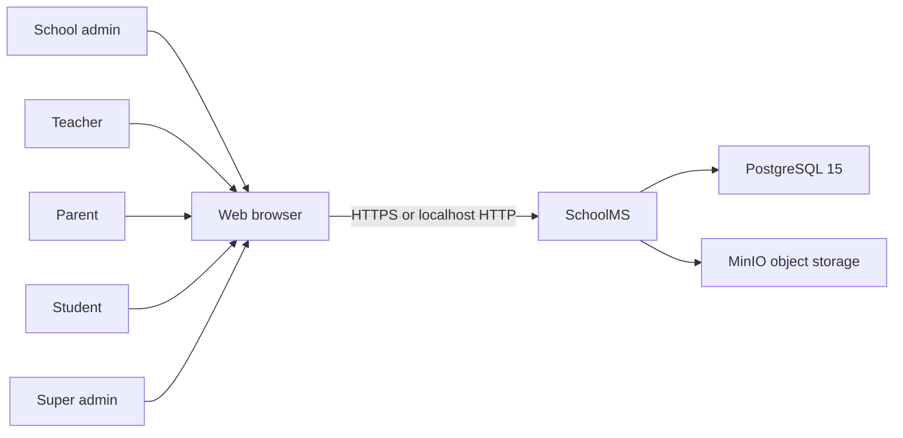
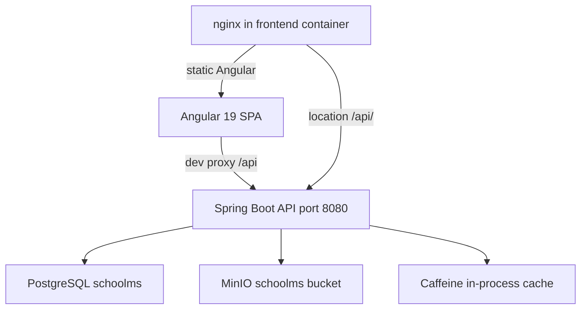
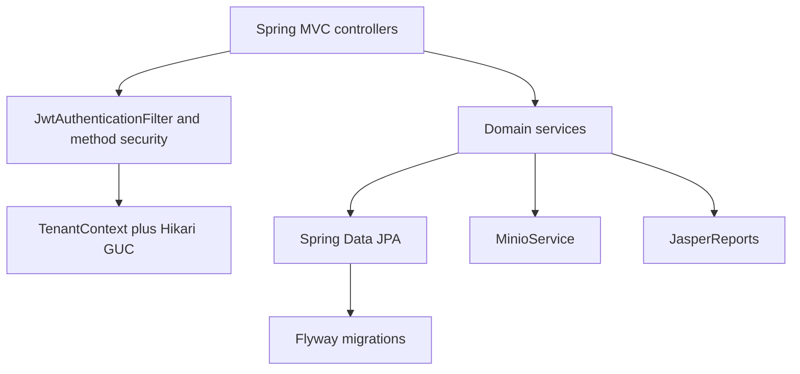
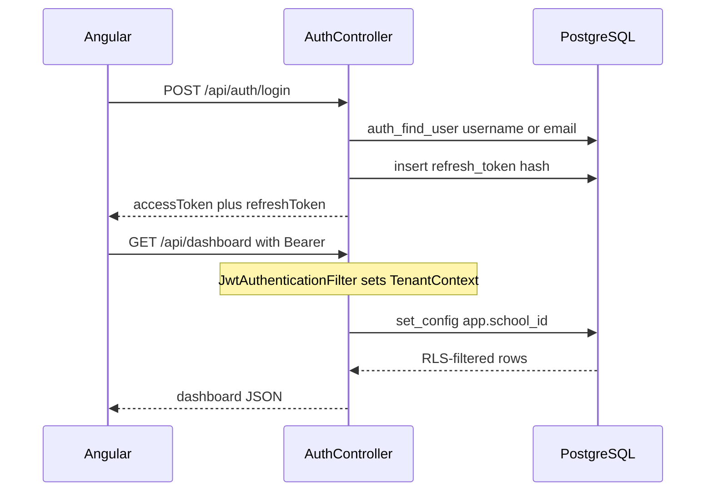
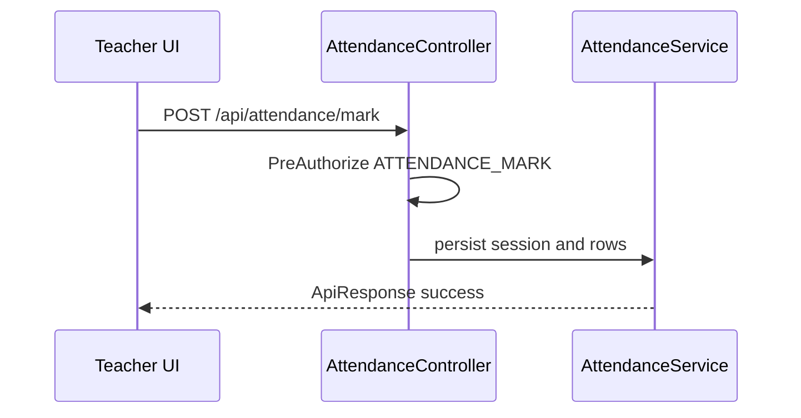
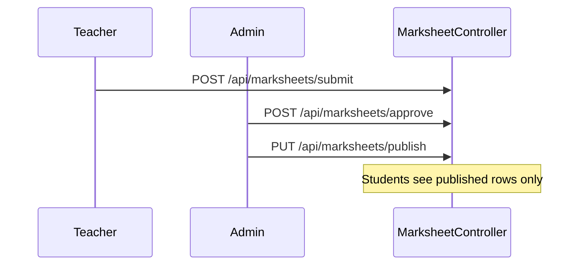
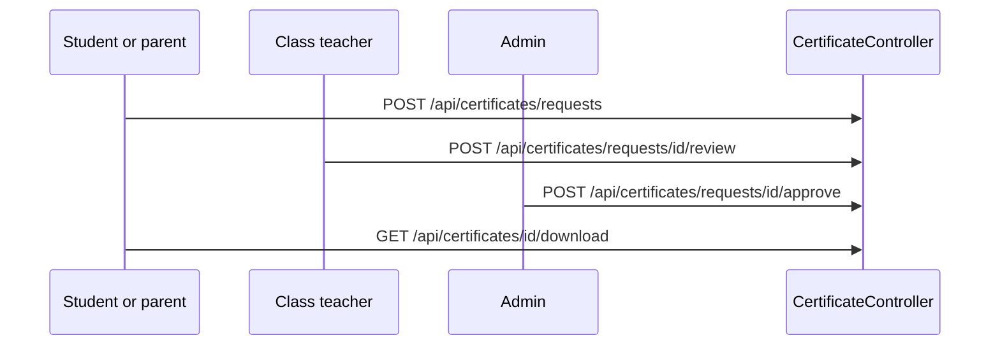

# System Architecture Document (SAD)

**Product:** School Management System (SchoolMS)
**Style:** C4 + sequence diagrams in Mermaid
**As-built:** Angular 19 SPA, Spring Boot 3.5 monolith, PostgreSQL 15, optional MinIO

This document describes the **current** system. It does not invent microservices, message buses, or cloud regions that are not in the repository.

---

## 1. High-Level System Diagram (C4)

### Level 1 — System context

Actors share one SPA. The API never talks to SMS, email, or payment-gateway systems in this version.

### Level 2 — Containers

| Container | Tech | Responsibility |
|---|---|---|
| Frontend | Angular 19, Material M3, ngx-translate | UI, auth session, `/api` calls |
| Frontend gateway | nginx (`frontend/nginx.conf`) or `ng serve` proxy | SPA routing; reverse-proxy `/api/` |
| Backend | Spring Boot 3.5.16, Java 21 | REST, security, JasperReports PDFs |
| Database | PostgreSQL 15 | System of record + RLS |
| Object storage | MinIO | Receipts, photos, certificate attachments |
| Cache | Caffeine | Permission authorities, 5-minute TTL |

There is **one backend deployable**. Packages under `com.schoolms.*` are modules, not independently deployed services.

### Level 3 — Backend modules

Communication pattern: **synchronous REST over HTTP**. No WebSockets, no GraphQL, no event queue.

---

## 2. Tech Stack Specifications

| Layer | Choice | Rationale |
|---|---|---|
| Frontend | Angular 19 standalone components | Typed SPA, route guards, signals |
| UI kit | Angular Material 19 M3 | Theme tokens, sidenav, tables |
| i18n | ngx-translate + Spring MessageSource | en, hi, ur including RTL |
| API | Spring Web MVC | Resource-oriented `/api/*` |
| Security | Spring Security + JJWT 0.12.6 | Stateless JWT, permission authorities |
| Persistence | Spring Data JPA, `ddl-auto: none` | Flyway owns schema |
| Migrations | Flyway V1–V28 | Repeatable, reviewed SQL |
| Database | PostgreSQL 15 | RLS, GUCs `app.school_id` / `app.bypass_rls` |
| Cache | Caffeine | In-process; Redis was removed |
| Files | MinIO 8.x client | S3-compatible, local or compose |
| PDFs | JasperReports 6.21 | Admit cards, report cards, receipts, certificates |
| Import | OpenCSV + Apache POI | Student CSV, marks CSV/Excel |
| Docs API | springdoc 2.8.9 | `/v3/api-docs`, `/swagger-ui.html` |
| Runtime | JDK 21 | LTS |
| Packaging | Maven JAR + Docker Compose | Local parity |

**Caching:** permission lookup only. **External APIs:** none required at runtime besides PostgreSQL and optional MinIO.

---

## 3. Component Responsibilities

| Package | Responsibility |
|---|---|
| `com.schoolms.auth` | Login, refresh rotation, logout |
| `com.schoolms.security` | JWT filter, principal, permission cache |
| `com.schoolms.tenant` | Thread-local school id; Hikari `set_config` |
| `com.schoolms.user` | Users, role assign, locale |
| `com.schoolms.school` | Schools |
| `com.schoolms.student` | Students, guardians, enrollment, import |
| `com.schoolms.academics` | Years, classes, sections, subjects, teachers, timetable, grading |
| `com.schoolms.staff` | Teaching and non-teaching staff |
| `com.schoolms.attendance` | Sessions and marks |
| `com.schoolms.fee` | Structures, payments, receipts |
| `com.schoolms.notice` | Notices and read receipts |
| `com.schoolms.dashboard` | Role aggregates |
| `com.schoolms.exam` | Schedules, marks, admit cards, report cards, marksheets |
| `com.schoolms.event` | Academic calendar |
| `com.schoolms.notification` | In-app inbox |
| `com.schoolms.certificate` | Templates, generate, request, approve, PDF |
| `com.schoolms.file` | MinIO |
| `com.schoolms.award` | Entity/repo only; no REST controller |
| `com.schoolms.common` | `ApiResponse`, errors, enums |

Frontend mirrors domains under `frontend/src/app/features/*` with `core/auth`, `core/theme`, `layout/*`.

---

## 4. Workflow Sequence Diagrams

### 4.1 Login and tenant stamping

### 4.2 Attendance mark

### 4.3 Marksheet publish

### 4.4 Certificate request

---

## 5. System Resiliency and Fault Tolerance

| Concern | Current behavior |
|---|---|
| Process crash | Restart the JAR or Compose service. No clustering. |
| Database down | API fails health/business calls; Hikari retries connections inside the pool. |
| MinIO down | Login and SIS still work; PDF/upload features fail. |
| JWT expiry | Frontend refresh interceptor; refresh rotation revokes previous token. |
| Duplicate requests | DB unique constraints (admission no, certificate pending request, timetable slot). |
| Retries | No Resilience4j circuit breaker. Clients should not blindly retry POSTs that record payments. |
| Rate limiting | None. |
| Backups | Operator-managed `pg_dump`; see `docs/devops/RUNBOOK.md`. |
| Scalability | Vertical scale of API + PostgreSQL. RLS shared-DB tenancy. |
| Fault isolation | Tenant isolation is data-level, not compute-level. |

**Failure scenarios to expect**

- Flyway fails if roles `schoolms` / `app_rls` are missing.
- CORS 403 if the UI origin is not in `CORS_ALLOWED_ORIGINS`.
- 401 when refresh token is revoked or expired (30 days).
- 409 on unique-constraint violations (`error.conflict`).
