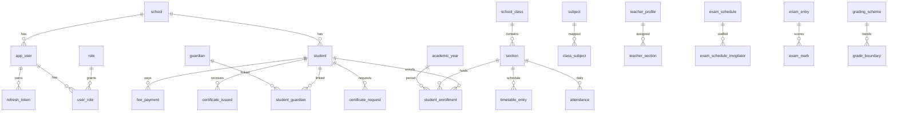

# Database Schema and Data Dictionary

**Engine:** PostgreSQL 15
**Migrations:** Flyway `backend/src/main/resources/db/migration/V1` through `V28` (no V7)
**Conventions:** UUID primary keys, `school_id` on tenant tables, VARCHAR enums with CHECK, `created_at` / `updated_at` on most entities

Runtime role: `app_rls`. Migrations role: `schoolms`. RLS helpers: `app_set_school_id`, `app_current_school_id`, `app_bypass_rls`. Policy predicate: `school_id = app_current_school_id() OR app_bypass_rls()`.

---

## 1. Entity-Relationship Diagram

Global tables (no RLS): `school`, `role`, `permission`, `role_permission`, `refresh_token`.
`app_user` has RLS enabled but not FORCE (login lookup uses `auth_find_user()` SECURITY DEFINER).

---

## 2. Data Dictionary

Audit columns `created_at TIMESTAMPTZ NOT NULL DEFAULT now()` and `updated_at TIMESTAMPTZ NOT NULL DEFAULT now()` are omitted below when present.

### 2.1 Auth and tenancy

#### `school`

| Column | Type | Constraints | Description |
|---|---|---|---|
| id | UUID | PK | School tenant |
| code | VARCHAR(50) | UNIQUE NOT NULL | Short code (`DEMO`) |
| name | VARCHAR(200) | NOT NULL | Display name |
| address, phone, email, logo_url | VARCHAR | nullable | Contact / brand |
| currency | VARCHAR(10) | NOT NULL default `INR` | Fee currency |
| default_locale | VARCHAR(10) | NOT NULL default `en` | UI default |
| timezone | VARCHAR(60) | NOT NULL default `Asia/Kolkata` | School TZ |
| academic_start_month | SMALLINT | NOT NULL default 4 | Academic calendar |
| status | VARCHAR(20) | `ACTIVE` / `SUSPENDED` | Tenant status |

#### `role`

| Column | Type | Constraints | Description |
|---|---|---|---|
| id | UUID | PK | Role id |
| code | VARCHAR(50) | UNIQUE | `SUPER_ADMIN`, `ADMIN`, `TEACHER`, `STUDENT`, `PARENT` |
| name, description | VARCHAR | | Display |
| is_system | BOOLEAN | NOT NULL | Seeded system roles |

#### `permission`

| Column | Type | Constraints | Description |
|---|---|---|---|
| id | UUID | PK | |
| code | VARCHAR(100) | UNIQUE | Authority string used in `@PreAuthorize` |
| module | VARCHAR(50) | NOT NULL | Grouping |
| name, description | VARCHAR | | |

#### `role_permission`

PK `(role_id, permission_id)`. FKs to `role`, `permission`.

#### `app_user`

| Column | Type | Constraints | Description |
|---|---|---|---|
| id | UUID | PK | |
| school_id | UUID | FK school, nullable | NULL for SUPER_ADMIN |
| username | VARCHAR(60) | UNIQUE with school_id | Login |
| email | VARCHAR(120) | UNIQUE with school_id | Alternate login |
| phone | VARCHAR(30) | | |
| password_hash | VARCHAR(100) | NOT NULL | BCrypt |
| first_name, last_name | VARCHAR | first NOT NULL | |
| locale | VARCHAR(10) | default `en` | |
| status | VARCHAR(20) | `ACTIVE` / `INACTIVE` / `LOCKED` | |
| last_login_at | TIMESTAMPTZ | | |

#### `user_role`

PK `id`. UNIQUE `(school_id, user_id, role_id)`.

#### `refresh_token`

| Column | Type | Constraints | Description |
|---|---|---|---|
| id | UUID | PK | |
| user_id | UUID | FK app_user | |
| token_hash | VARCHAR(128) | NOT NULL | SHA-256 of opaque token |
| expires_at | TIMESTAMPTZ | NOT NULL | 30 days from issue |
| revoked_at | TIMESTAMPTZ | | Rotation / logout |
| device_info | VARCHAR(255) | | Optional |

Index: `idx_refresh_token_user (user_id)`. No `school_id`.

### 2.2 Student

#### `student`

UNIQUE `(school_id, admission_no)`. Optional `user_id`. Status `ACTIVE` / `INACTIVE` / `ALUMNI` / `TRANSFERRED`. Index `idx_student_school_name (school_id, last_name)`. V10 adds phone, emergency contact, addresses, previous school.

#### `guardian`

Optional `user_id`. Relationship `FATHER` / `MOTHER` / `GUARDIAN` / `OTHER`.

#### `student_guardian`

UNIQUE `(school_id, student_id, guardian_id)`. `is_primary` boolean.

#### `student_enrollment`

UNIQUE `(student_id, academic_year_id)`. FK section + academic year. Status `ACTIVE` / `PROMOTED` / `LEFT`. Index `idx_enrollment_section`.

### 2.3 Academics and staff

| Table | Unique / keys | Notes |
|---|---|---|
| `academic_year` | `(school_id, name)` | `is_current` |
| `school_class` | `(school_id, name)` | `sort_order` |
| `section` | `(class_id, name)` | `capacity`, V11 `room` |
| `subject` | `(school_id, name)` | CORE/ELECTIVE; V12 weekly_periods, practical, status |
| `class_subject` | `(class_id, subject_id)` | V12 optional `teacher_id` |
| `teacher_profile` | `(school_id, employee_no)` | Optional `user_id`; V18 HR fields |
| `teacher_subject` | `(school_id, teacher_id, subject_id)` | |
| `teacher_section` | `(school_id, teacher_id, section_id, academic_year_id)` | `is_class_teacher` |
| `non_teaching_staff` | `(school_id, employee_no)` | V18 |
| `timetable_entry` | `(section_id, academic_year_id, day_of_week, period_number)` | `day_of_week` 0–6 |
| `grading_scheme` | `(school_id, academic_year_id, class_id, name)` | Partial unique one ACTIVE per class |
| `grade_boundary` | FK scheme | Min/max marks, grade letter |
| `assessment_weightage` | `(scheme_id, assessment_type)` | Weights |

### 2.4 Attendance

| Table | Unique | Status |
|---|---|---|
| `attendance_session` | `(section_id, attendance_date, subject_id)` | PENDING / PARTIAL / COMPLETE |
| `attendance` | `(student_id, attendance_date)` | PRESENT / ABSENT / LATE / LEAVE |

Index: `idx_attendance_section_date (school_id, section_id, attendance_date)`.

### 2.5 Fees

| Table | Unique | Notes |
|---|---|---|
| `fee_category` | `(school_id, code)` | |
| `fee_structure` | `(class_id, academic_year_id, category_id)` | amount, frequency MONTHLY/QUARTERLY/ANNUAL |
| `student_fee_assignment` | `(student_id, fee_structure_id)` | discount FIXED/PERCENT |
| `fee_installment` | `(student_fee_assignment_id, due_date)` | PENDING/PAID/PARTIAL/OVERDUE/WAIVED |
| `fee_payment` | `(school_id, receipt_no)` | CASH/CARD/UPI/BANK_TRANSFER; `pdf_url` |

Index: `idx_fee_payment_student (school_id, student_id)`.

### 2.6 Notices

`notice` (status draft/published/archived, audience), `notice_attachment`, `notice_read_receipt` UNIQUE `(school_id, notice_id, user_id)`. Index `idx_notice_school_status`.

### 2.7 Exams and results

| Table | Unique | Migration |
|---|---|---|
| `exam_entry` | `(school_id, academic_year_id, section_id, subject_id, exam_term)` | V15 |
| `exam_mark` | `(exam_entry_id, student_id)` | V15 |
| `exam_schedule` | `(school_id, academic_year_id, section_id, subject_id, exam_term)` | V19 |
| `exam_schedule_invigilator` | `(exam_schedule_id, teacher_id)` | V19 |
| `report_card` | `(school_id, academic_year_id, student_id, exam_term)` | V22 |
| `marksheet` | `(school_id, academic_year_id, student_id, exam_term)`; unique `serial_no` | V24/V25 |

Admit cards are **generated**, not stored as a table.

### 2.8 Calendar, awards, notifications

| Table | Notes |
|---|---|
| `school_event` | V16/V23; types include PTM/SPORTS/NOTICE; visibility ROLE + `audience_role`; index date |
| `award` | `idx_award_school_date`, `idx_award_student`; no REST API |
| `notifications` | V26; unique `(school_id, recipient_id, source_key)` where source_key present; categories EXAM, ATTENDANCE, FEE, ASSIGNMENT, CERTIFICATE |

### 2.9 Certificates

| Table | Unique / notes | Migration |
|---|---|---|
| `certificate_template` | `(school_id, type)`; types TC, BONAFIDE, CHARACTER, COURSE_COMPLETION | V27 |
| `certificate_issued` | unique `certificate_no`; optional `request_id` | V27/V28 |
| `certificate_request` | partial unique pending `(school_id, student_id, certificate_type)` for SUBMITTED/TEACHER_REVIEWED | V28 |

All three have RLS.

---

## 3. Indexes and Partitioning

**Partitioning:** none. All tables are heap tables in the default tablespace.

**Notable indexes (beyond PKs/uniques)**

- `idx_refresh_token_user`
- `idx_student_school_name`
- `idx_enrollment_section`
- `idx_attendance_section_date`
- `idx_fee_payment_student`
- `idx_notice_school_status`
- Exam schedule date/room indexes (V19)
- `idx_report_card` section (V22)
- `idx_school_event_school_date`
- `idx_award_school_date`, `idx_award_student`
- `idx_notifications_recipient`
- `idx_non_teaching_staff_school`
- Certificate issued indexes on student/status/type (V27)

Query pattern: always include `school_id` (RLS adds it for `app_rls`). List endpoints paginate in the service layer.

---

## 4. Data Retention and Archival

| Data | Current policy | Notes |
|---|---|---|
| Operational rows | Kept indefinitely | No purge jobs |
| Refresh tokens | Row retained; `revoked_at` set | Rotation does not delete |
| Notices | Archived via status, not deleted in UI | `NOTICE_DELETE` exists on API |
| Students | Deactivate / TRANSFERRED rather than hard delete | TC workflow may deactivate user |
| Files in MinIO | Manual | Bucket `schoolms`; no lifecycle rules in Compose |
| Encryption at rest | PostgreSQL/volume encryption is the operator’s responsibility | App does not AES-encrypt columns |
| Backups | `pg_dump` / volume snapshots | See `docs/devops/RUNBOOK.md` |

There is no automated archival to cold storage in this version.
