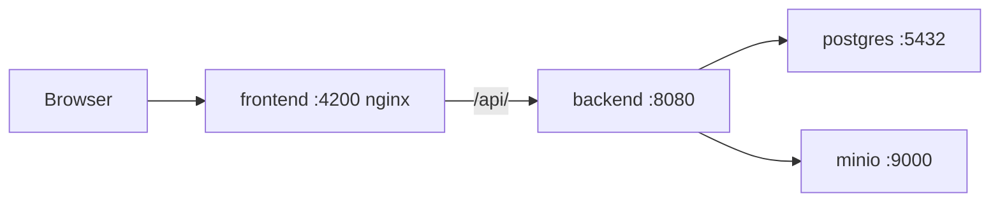

# DevOps and Infrastructure Deployment Guide

**As-built.** This repository ships Docker Compose for local/single-host use. There is **no** GitHub Actions workflow, Kubernetes manifest, Terraform, or cloud environment in the repo.

---

## 1. Environment Infrastructure Architecture



| Environment | How it is realized today |
|---|---|
| Dev | JDK 21 + Maven + Node 20 + PostgreSQL 15 on the workstation, or Compose |
| Staging | Not provisioned |
| Production | Not provisioned; use prod Spring profile + required secrets if you host it yourself |
| Kubernetes | Not used |

Compose services (`docker-compose.yml`): `postgres`, `minio`, `backend`, `frontend`. Volumes: `pgdata`, `miniodata`.

Ports: PostgreSQL 5432, MinIO 9000/9001, backend 8080, frontend 4200 (maps to nginx 80 in the container).

---

## 2. CI/CD Pipeline Workflow

**Current:** none. `.github/workflows` is empty.

**Recommended future pipeline** (not implemented):

1. Checkout
2. `mvn -f backend/pom.xml test`
3. `npm ci && npm run build` in `frontend/`
4. `docker compose build`
5. Push images to a registry
6. Deploy to a single VM or future cluster

Until that exists, quality gates are local: `mvn test`, `npm run build`, and manual smoke login.

---

## 3. Secrets and Environment Variables

Copy `.env.example` to `.env`. Never commit `.env`.

| Variable | Default (dev) | Production |
|---|---|---|
| `POSTGRES_HOST` | `localhost` | Managed DB host |
| `POSTGRES_PORT` | `5432` | |
| `POSTGRES_DB` | `schoolms` | |
| `POSTGRES_USER` | `schoolms` | Flyway / owner |
| `POSTGRES_PASSWORD` | `schoolms` | Strong secret |
| `SPRING_DATASOURCE_URL` | derived from POSTGRES_* | JDBC URL |
| `SPRING_DATASOURCE_USERNAME` | `app_rls` | RLS role |
| `SPRING_DATASOURCE_PASSWORD` | `app_rls` | Strong secret |
| `SPRING_FLYWAY_USER` | `schoolms` | Schema owner |
| `SPRING_FLYWAY_PASSWORD` | `schoolms` | Strong secret |
| `JWT_SECRET` | dev placeholder | **Required**, 32+ chars, no default in `application-prod.yml` |
| `MINIO_ENDPOINT` | `http://localhost:9000` | Internal URL |
| `MINIO_ACCESS_KEY` / `MINIO_SECRET_KEY` | `minioadmin` | Required in prod profile |
| `MINIO_BUCKET` | `schoolms` | |
| `CORS_ALLOWED_ORIGINS` | localhost + `https://*.monkeycode-ai.live` | Explicit https origins |
| `SPRING_PROFILES_ACTIVE` | `dev` | `prod` |

There is no HashiCorp Vault or AWS Secrets Manager integration. Inject env vars via Compose, systemd, or your host’s secret store.

Local PostgreSQL roles (non-Compose):

```sql
CREATE ROLE schoolms LOGIN PASSWORD 'schoolms';
CREATE ROLE app_rls  LOGIN PASSWORD 'app_rls';
CREATE ROLE app_admin LOGIN PASSWORD 'app_admin';
CREATE DATABASE schoolms OWNER schoolms;
```

---

## 4. Deployment and Rollback SOPs

### 4.1 Local Docker (supported)

```bash
cp .env.example .env
docker compose up --build
```

Frontend: http://localhost:4200
API: http://localhost:8080
Swagger: http://localhost:8080/swagger-ui.html
MinIO console: http://localhost:9001 (`minioadmin` / `minioadmin`)

Stop: `docker compose down`. Wipe data: `docker compose down -v` (destructive; confirm first).

### 4.2 Local without Docker

Requirements: JDK 21, Maven 3.9+, Node 20+, PostgreSQL 15.

```bash
createdb schoolms
cd backend && mvn spring-boot:run -Dspring-boot.run.profiles=dev
cd frontend && npm install && npm start
```

Or `scripts/run-linux.sh` / `scripts/run-windows.bat`. Apply SQL with `scripts/apply-db.sh` if Flyway is not used.

### 4.3 Production-like host (operator-owned)

1. Create PostgreSQL roles and database.
2. Set `SPRING_PROFILES_ACTIVE=prod` and all required secrets (`JWT_SECRET`, MinIO keys, DB passwords).
3. `mvn -DskipTests package` then run the JAR, **or** build Compose images with prod env.
4. Serve the Angular build behind nginx that proxies `/api/` to the backend (see `frontend/nginx.conf`).
5. Restrict CORS to the public UI origin.
6. Put TLS in front (this repo does not terminate HTTPS).

**Blue-green / canary:** not implemented. A practical rollback on a single host:

1. Keep the previous JAR/image tag.
2. Stop the new process.
3. Start the previous artifact with the same env.
4. If a Flyway migration already ran, **do not** automatically reverse SQL. Restore PostgreSQL from the pre-deploy backup (see `RUNBOOK.md`) if the schema is incompatible.

**Zero-downtime:** not available with one instance. Expect a short outage on restart.
