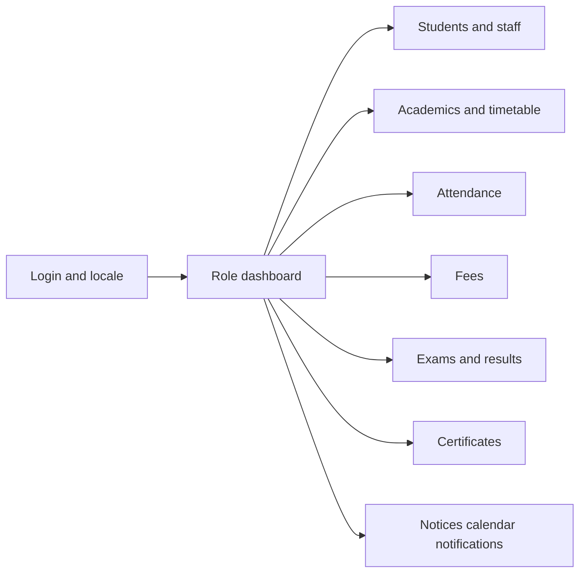

# User Story Map and Scope

**Product:** School Management System (SchoolMS)
**Prioritization:** MoSCoW against the **shipped** application (v0.1.0-SNAPSHOT)
**Roles:** `SUPER_ADMIN`, `ADMIN`, `TEACHER`, `PARENT`, `STUDENT`

Must-Have items are implemented unless noted. Won't-Have items are explicit non-goals for this version.

---

## 1. User Journey Epics

| Epic | Journey |
|---|---|
| E1 Identity | Login, refresh, logout, locale, theme, profile menu |
| E2 School ops | Super-admin schools; admin runs one school |
| E3 SIS | Enroll students, guardians, profiles |
| E4 Staff | Teachers, class teachers, non-teaching |
| E5 Academics | Classes, sections, subjects, timetable, grading schemes |
| E6 Attendance | Mark day, review history |
| E7 Fees | Structure, assign, collect, receipt |
| E8 Communication | Notices, calendar, in-app bell |
| E9 Assessment | Schedules, marks, admit cards, report cards, marksheet approval |
| E10 Certificates | Request, review, approve, download TC/bonafide |

---

## 2. Itemized User Stories

Format: *As a [Role], I want [Action] so that [Benefit]*. IDs align with PRD (`PR-*`) where useful.

### E1 Identity

| ID | Story | MoSCoW |
|---|---|---|
| US-01 | As any user, I want to sign in with username/password so that I reach my dashboard | Must |
| US-02 | As any user, I want my session to refresh silently so that I am not logged out every 15 minutes | Must |
| US-03 | As any user, I want to log out so that the refresh token is revoked | Must |
| US-04 | As any user, I want English/Hindi/Urdu so that I can use the UI in my language | Must |
| US-05 | As any user, I want light/dark theme so that the UI matches my preference | Should |
| US-06 | As a TC-deactivated student, I want a clear login error so that I know the account is closed | Must |

### E2 School ops

| ID | Story | MoSCoW |
|---|---|---|
| US-10 | As a super admin, I want to create and list schools so that multiple tenants share one platform | Must |
| US-11 | As an admin, I want data limited to my school so that other schools cannot see our students | Must |
| US-12 | As an admin, I want a users API so that I can provision logins | Should (API exists; no dedicated UI) |

### E3 SIS

| ID | Story | MoSCoW |
|---|---|---|
| US-20 | As an admin, I want to add a student with admission number so that enrollment is unique | Must |
| US-21 | As an admin, I want to edit/deactivate students so that leavers are not active | Must |
| US-22 | As an admin, I want guardians linked to students so that parents can log in later | Must |
| US-23 | As an admin, I want CSV import so that I can onboard a class quickly | Should |
| US-24 | As a teacher, I want to read students in my sections so that I can teach and mark | Must |
| US-25 | As a class teacher, I want to edit allowed profile fields so that contact data stays current | Should |
| US-26 | As a parent/student, I want a profile view of the linked student so that I see academic context | Could (parent has no `STUDENT_READ` in seed; student profile is staff-oriented) |

### E4 Staff

| ID | Story | MoSCoW |
|---|---|---|
| US-30 | As an admin, I want teaching staff with employee numbers so that teachers are uniquely identified | Must |
| US-31 | As an admin, I want to assign a class teacher to a section so that that teacher owns the class | Must |
| US-32 | As an admin, I want non-teaching staff records so that office/lab/security are listed | Should |

### E5 Academics

| ID | Story | MoSCoW |
|---|---|---|
| US-40 | As an admin, I want classes and sections with capacity/room so that I can structure the school | Must |
| US-41 | As an admin, I want subjects mapped to classes and teachers so that the timetable has data | Must |
| US-42 | As an admin, I want a weekly timetable without teacher/room clashes so that periods are valid | Must |
| US-43 | As a teacher/student/parent, I want to read the timetable so that I know the schedule | Must |
| US-44 | As an admin, I want grading schemes so that marks convert to grades | Must |
| US-45 | As an admin, I want syllabus and term pages so that curriculum is documented | Won't (placeholders) |

### E6 Attendance

| ID | Story | MoSCoW |
|---|---|---|
| US-50 | As a teacher, I want to mark Present/Absent/Late/Leave for a section/date so that the register is digital | Must |
| US-51 | As a parent/student, I want attendance history so that I can see absences | Must |
| US-52 | As an admin, I want today's attendance on the dashboard so that I can intervene | Should |

### E7 Fees

| ID | Story | MoSCoW |
|---|---|---|
| US-60 | As an admin, I want fee structures per class/year/category so that dues are defined | Must |
| US-61 | As an admin, I want to record a payment and get a receipt number so that accounts can reconcile | Must |
| US-62 | As a parent, I want to see installments and receipts so that I know what is due | Must |
| US-63 | As a parent, I want to pay online via UPI/card gateway so that I need not visit the office | Won't (methods are recorded manually) |

### E8 Communication

| ID | Story | MoSCoW |
|---|---|---|
| US-70 | As an admin, I want to publish notices to everyone/teachers/parents so that messages are targeted | Must |
| US-71 | As any user, I want unread notice/notification counts so that I do not miss updates | Must |
| US-72 | As an admin, I want calendar events with role/class visibility so that PTMs and holidays are scoped | Must |
| US-73 | As an admin, I want a holiday PDF export so that I can print the list | Should |
| US-74 | As any user, I want email/SMS alerts so that I am notified offline | Won't |

### E9 Assessment

| ID | Story | MoSCoW |
|---|---|---|
| US-80 | As an admin, I want exam schedules with overlap checks so that rooms and sections do not clash | Must |
| US-81 | As a teacher, I want a marks grid with lock and CSV import so that I can submit results | Must |
| US-82 | As a student, I want an admit card only when the schedule is published so that drafts stay internal | Must |
| US-83 | As a student/parent, I want a report card and marksheet only after publish so that unofficial marks stay hidden | Must |
| US-84 | As an admin, I want submit/approve/reject marksheets so that results have a two-step release | Must |
| US-85 | As an admin, I want exam analytics and re-evaluation workflows so that I can analyze and recheck | Won't (placeholders) |

### E10 Certificates

| ID | Story | MoSCoW |
|---|---|---|
| US-90 | As an admin, I want certificate templates so that letterhead is consistent | Must |
| US-91 | As a teacher/admin, I want to generate TC/bonafide drafts so that office staff can issue papers | Must |
| US-92 | As a student/parent, I want to request a certificate with an optional file so that I do not visit the office first | Must |
| US-93 | As a class teacher, I want to forward only my section’s requests so that review is scoped | Must |
| US-94 | As an admin, I want to approve or reject requests so that issuance is controlled | Must |
| US-95 | As an admin, I want TC issuance to deactivate the student login so that transferred students cannot sign in | Must |

---

## 3. Prioritization Matrix (MoSCoW)

| Must-Have (v1 shipped) | Should-Have (shipped or API-only) | Could-Have | Won't-Have (this version) |
|---|---|---|---|
| Auth JWT + refresh + RBAC + RLS | Dark theme, sidenav collapse | Dedicated users UI | Principal role |
| Students, staff, academics, timetable | Student CSV import | Parent self-edit of profile | Online payment gateway |
| Attendance, fees, notices | Holiday PDF, widget customize | Award showcase API (entity exists, no controller) | SMS/email |
| Exams, admit/report/marksheet workflows | Grading schemes UI | Super-admin rich UI | GraphQL / WebSockets |
| Certificates request/approve | Urdu RTL | Syllabus content | Kubernetes-required deploy |
| Dashboard + notifications | MinIO attachments | Exam analytics | HIPAA program |
| en/hi/ur | Docker Compose pack | Re-evaluation | GitHub Pages site |

---

## 4. MVP vs Post-MVP Boundaries

### Included in current product (treat as v1.0 scope)

- Docker Compose: PostgreSQL 15, MinIO, backend 8080, frontend nginx 4200
- Flyway through **V28** (certificate requests)
- Angular Material M3 shell
- Modules listed in Must-Have and Should-Have above
- Live OpenAPI at `/v3/api-docs` and Swagger UI `/swagger-ui.html`

### Explicitly post-MVP / future

- Syllabus, academic terms UI
- Exam analytics and re-evaluation
- Users/roles admin screens
- SMTP, SSO, payment providers
- CI/CD, staging/production cloud, APM dashboards
- Point-in-time backup automation and documented HA
- GitHub Pages publishing of this `/docs` tree (markdown in repo only)

### Release numbering

The backend artifact is `0.1.0-SNAPSHOT`. Changelog entries in root `CHANGELOG.md` follow Keep a Changelog against git history, not a marketing version bump.
